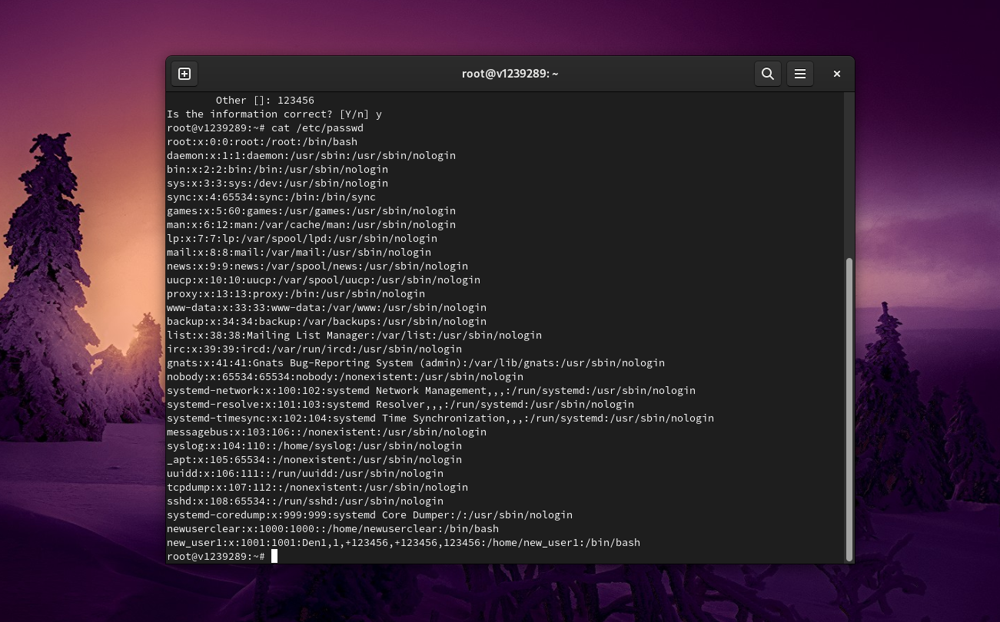
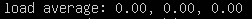

# UNIX/Linux operating systems (Basic).

Linux system installation and updates. Administration basics.

## Part 1. Installation of the OS

##### Install Ubuntu 20.04 Server LTS.

## Part 2. Creating a user

##### Create a user other than the one created during installation. The user must have permission to read logs from the /var/log folder.

## Part 3. Setting up the OS network

##### Set the machine name as user-1
##### Set the time zone corresponding to your current location.

##### Output the names of the network interfaces using a console command.

Interface lo can be used by network client software to communicate with a server application located on the same computer. That is, if you specify the URL http://127.0.0.1/ or http://localhost/ in the web browser on the computer where the web server is running, it takes you to that computer's web site. This mechanism works without any active connection, so it is useful for testing services without compromising their security as with remote network access.

##### Define and display the external ip address of the gateway (ip) and the internal IP address of the gateway, aka default ip address (gw).

Dynamic Host Configuration Protocol (DHCP).

##### Set static (manually set, not received from DHCP server) ip, gw, dns settings (use public DNS servers, e.g. 1.1.1.1 or 8.8.8.8).

##### Reboot the virtual machine. Make sure that the static network settings (ip, gw, dns) correspond to those set in the previous point.

## Part 4. OS Update

##### Update the system packages to the latest version

## Part 5. Using the **sudo** command

##### Allow user created in [Part 2](#part-2-creating-a-user) to execute sudo command.

sudo allows a permitted user to execute a command as the superuser or another user, as specified by the security policy.  The invoking user's real (not effective) user-ID is used to determine the user name with which to query the security policy.

## Part 6. Installing and configuring the time service

##### Set up the automatic time synchronisation service.

output of the timedatectl command (to configure the automatic time synchronization service "timedatectl set-ntp on").

## Part 7. Installing and using text editors

##### Install **VIM** text editor (+ any two others if you like **NANO**, **MCEDIT**, **JOE** etc.)

`joe test_joe.txt`

CTRL + K - X for exit with save

`joe test_joe.txt`

CTRL + C for exit without save

`vim test_vim.txt`

:wq for exit with save

`vim test_vim.txt`

:q! for exit without save

`nano test_nano.txt`

Ctrl + S then Ctrl + X for exit with save

`nano test_nano.txt`

Ctrl + X then 'n' for exit without save

## Part 8. Installing and basic setup of the **SSHD** service

##### Install the SSHd service.
`sudo apt-get install openssh-server`

`sudo systemctl enable ssh` - to enable ssh on boot

##### Add an auto-start of the service whenever the system boots.
`systemctl list-unit-files --type=service --state=enabled`

##### Reset the SSHd service to port 2022.
`vim /etc/ssh/sshd_config`

`service ssh restart`

`netstat -tan`

netstat: -t (--tcp) tcp protocol output -a (--all) Show both listening and non-listening sockets -n (--numeric) Show numerical addresses instead of trying to determine symbolic host, port or user names Proto - the protocol (tcp, udp, raw) used by the socket.

Recv-Q - the count of bytes not copied by the user program connected to this socket.

Send-Q - the count of bytes not acknowledged by the remote host.

Local Address - Address and port number of the local end of the socket. Unless the --numeric (-n) option is specified, the socket address is resolved to its canonical host name (FQDN), and the port number is translated into the corresponding service name.

Foreign Address (0.0.0.0) - address and port number of the remote end of the socket. Analogous to "Local Address."

State - the state of the socket. Since there are no states in raw mode and usually no states used in UDP, this column may be left blank.

##### Show the presence of the sshd process using the ps command. To do this, you need to match the keys to the command.

ps -aux | grep sshd output ps: `a` this option causes ps to list all processes with a terminal (tty), or to list all processes when used together with the x option. `u` Display user-oriented format. `x` this option causes ps to list all processes owned by you (same EUID as ps), or to list all processes when used together with the a option.

##### Reboot the system.

## Part 9. Installing and using the **top**, **htop** utilities

##### Install and run the top utility.

The top program provides a dynamic real-time view of a running system.

 - uptime

 - number of authorised users

 - total system load

 - total number of processes

 - cpu load

 - memory load

pid of the process with the highest memory usage By selecting the %MEM column by keys `<` `>` and pressing `Shift` we get sorted process.

##### Install and run the htop utility.

The htop - interactive process viewer.

sorted by PID.

sorted by PERCENT_CPU.

sorted by PERCENT_MEM.

sorted by TIME.

## Part 10. Using the **fdisk** utility

`fdisk -l`

`swapon --show`

Obtained information about the disk and swap file.

## Part 11. Using the **df** utility

##### Run the df command.

1-K blocks = 1024 bytes

Size: 31658,25 Мб

Used: 4602,96 Мб

Available: 25728,64 Мб

Use: 16%

##### Run the df -Th command.

Size: 30Gb

Used: 4.3Gb

Avail: 24Gb

Use%: 16%

Type filisystem: ext4

## Part 12. Using the **du** utility

Run the du command.

`du`

Output the size of the /home, /var, /var/log folders (in bytes, in human readable format).

`du -shb /home /var/log /var`  - in bytes

`du -sh /home /var/log /var`

Output the size of all contents in /var/log (not the total, but each nested element using *)

`du -sh /var/log/*`

## Part 13. Installing and using the **ncdu** utility

Install the ncdu utility.

`sudo apt install ncdu`

`ncdu`

Output the size of the /home, /var, /var/log folders.

## Part 14. Working with system logs

Open for viewing:

`vim /var/log/dmesg`

`vim /var/log/syslog`

`cat /var/log/auth.log | grep systemd-logind` - the last successful login time

`sudo systemctl restart ssh.service`

`vim /var/log/syslog`

## Part 15. Using the **CRON** job scheduler

Using the job scheduler, run the uptime command in every 2 minutes.

`crontab -e` and press `Enter`

`vim /var/log/syslog`

